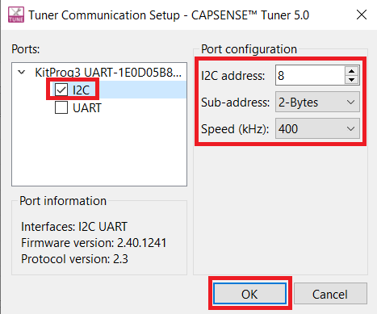

# EZ-PD&trade; PMG1 MCU: CAPSENSE&trade; CSD button tuning

This code example demonstrates how to manually tune a CAPSENSE&trade; Sigma Delta (CSD)-based button widget in EZ-PD&trade; PMG1-S3 device using the CAPSENSE&trade; Tuner.

[View this README on GitHub.](https://github.com/Infineon/mtb-example-pmg1-capsense-csd-button-tuning)

[Provide feedback on this code example.](https://cypress.co1.qualtrics.com/jfe/form/SV_1NTns53sK2yiljn?Q_EED=eyJVbmlxdWUgRG9jIElkIjoiQ0UyMzUyMTQiLCJTcGVjIE51bWJlciI6IjAwMi0zNTIxNCIsIkRvYyBUaXRsZSI6IkVaLVBEJnRyYWRlOyBQTUcxIE1DVTogQ0FQU0VOU0UmdHJhZGU7IENTRCBidXR0b24gdHVuaW5nIiwicmlkIjoibnNoIiwiRG9jIHZlcnNpb24iOiIxLjAuMCIsIkRvYyBMYW5ndWFnZSI6IkVuZ2xpc2giLCJEb2MgRGl2aXNpb24iOiJNQ0QiLCJEb2MgQlUiOiJXSVJFRCIsIkRvYyBGYW1pbHkiOiJUWVBFLUMifQ==)


## Requirements

- [ModusToolbox&trade; software](https://www.infineon.com/modustoolbox) v3.0 or later (tested with v3.0)
- Board support package (BSP) minimum required version: 3.0.0
- Programming language: C
- Associated parts: [EZ-PD&trade; PMG1 S3 MCU](https://www.infineon.com/CY7113)


## Supported toolchains (make variable 'TOOLCHAIN')

- GNU Arm&reg; Embedded Compiler v10.3.1 (`GCC_ARM`) - Default value of `TOOLCHAIN`
- Arm&reg; Compiler v6.13 (`ARM`)
- IAR C/C++ Compiler v8.42.2 (`IAR`)


## Supported kits (make variable 'TARGET')

- [EZ-PD&trade; PMG1-S3 prototyping kit](https://www.infineon.com/CY7113) (`PMG1-CY7113`) - Default value of `TARGET`


## Hardware setup

For kit version older than **CY7113 board revision 3 or lower**, connect J6.10 to J3.8 and J6.9 to J3.10 to establish a UART connection between KitProg3 and the PMG1 device.

See the kit user guide to ensure that the board is configured correctly.

**Note:** See [Compile-time configurations](#compile-time-configurations) for more details on enabling/disabling UART debug print messages.


## Software setup

Install a terminal emulator if you don't have one. Instructions in this document use [Tera Term](https://ttssh2.osdn.jp/index.html.en).


## Using the code example

Create the project and open it using one of the following:

<details><summary><b>In Eclipse IDE for ModusToolbox&trade; software</b></summary>

1. Click the **New Application** link in the **Quick Panel** (or, use **File** > **New** > **ModusToolbox&trade; Application**). This launches the [Project Creator](https://www.infineon.com/ModusToolboxProjectCreator) tool.

2. Pick a kit supported by the code example from the list shown in the **Project Creator - Choose Board Support Package (BSP)** dialog.

   When you select a supported kit, the example is reconfigured automatically to work with the kit. To work with a different supported kit later, use the [Library Manager](https://www.infineon.com/ModusToolboxLibraryManager) to choose the BSP for the supported kit. You can use the Library Manager to select or update the BSP and firmware libraries used in this application. To access the Library Manager, click the link from the **Quick Panel**.

   You can also just start the application creation process again and select a different kit.

   If you want to use the application for a kit not listed here, you may need to update the source files. If the kit does not have the required resources, the application may not work.

3. In the **Project Creator - Select Application** dialog, choose the example by enabling the checkbox.

4. (Optional) Change the suggested **New Application Name**.

5. The **Application(s) Root Path** defaults to the Eclipse workspace which is usually the desired location for the application. If you want to store the application in a different location, you can change the *Application(s) Root Path* value. Applications that share libraries should be in the same root path.

6. Click **Create** to complete the application creation process.

For more details, see the [Eclipse IDE for ModusToolbox&trade; software user guide](https://www.infineon.com/MTBEclipseIDEUserGuide) (locally available at *{ModusToolbox&trade; software install directory}/docs_{version}/mt_ide_user_guide.pdf*).

</details>

<details><summary><b>In command-line interface (CLI)</b></summary>

ModusToolbox&trade; software provides the Project Creator as both a GUI tool and the command line tool, "project-creator-cli". The CLI tool can be used to create applications from a CLI terminal or from within batch files or shell scripts. This tool is available in the *{ModusToolbox&trade; software install directory}/tools_{version}/project-creator/* directory.

Use a CLI terminal to invoke the "project-creator-cli" tool. On Windows, use the command line "modus-shell" program provided in the ModusToolbox&trade; software installation instead of a standard Windows command-line application. This shell provides access to all ModusToolbox&trade; software tools. You can access it by typing `modus-shell` in the search box in the Windows menu. In Linux and macOS, you can use any terminal application.

The "project-creator-cli" tool has the following arguments:

Argument | Description | Required/optional
---------|-------------|-----------
`--board-id` | Defined in the `<id>` field of the [BSP](https://github.com/Infineon?q=bsp-manifest&type=&language=&sort=) manifest | Required
`--app-id`   | Defined in the `<id>` field of the [CE](https://github.com/Infineon?q=ce-manifest&type=&language=&sort=) manifest | Required
`--target-dir`| Specify the directory in which the application is to be created if you prefer not to use the default current working directory | Optional
`--user-app-name`| Specify the name of the application if you prefer to have a name other than the example's default name | Optional

<br>

The following example clones the "[CAPSENSE&trade; CSD button tuning](https://github.com/Infineon/mtb-example-pmg1-capsense-button-tuning)" application with the desired name "MyCSDButtonTuning" configured for the *PMG1-CY7113* BSP into the specified working directory, *C:/mtb_projects*:

   ```
   project-creator-cli --board-id PMG1-CY7113 --app-id mtb-example-pmg1-capsense-csd-button-tuning --user-app-name MyCSDButtonTuning --target-dir "C:/mtb_projects"
   ```

**Note:** The project-creator-cli tool uses the `git clone` and `make getlibs` commands to fetch the repository and import the required libraries. For details, see the "Project creator tools" section of the [ModusToolbox&trade; software user guide](https://www.infineon.com/ModusToolboxUserGuide) (locally available at *{ModusToolbox&trade; software install directory}/docs_{version}/mtb_user_guide.pdf*).

To work with a different supported kit later, use the [Library Manager](https://www.infineon.com/ModusToolboxLibraryManager) to choose the BSP for the supported kit. You can invoke the Library Manager GUI tool from the terminal using `make library-manager` command or use the Library Manager CLI tool "library-manager-cli" to change the BSP.

The "library-manager-cli" tool has the following arguments:

Argument | Description | Required/optional
---------|-------------|-----------
`--add-bsp-name` | Name of the BSP that should be added to the application | Required
`--set-active-bsp` | Name of the BSP that should be as active BSP for the application | Required
`--add-bsp-version`| Specify the version of the BSP that should be added to the application if you do not wish to use the latest from manifest | Optional
`--add-bsp-location`| Specify the location of the BSP (local/shared) if you prefer to add the BSP in a shared path | Optional

<br>

Following example adds the PMG1-CY7113 BSP to the already created application and makes it the active BSP for the app:

   ```
   ~/ModusToolbox/tools_3.0/library-manager/library-manager-cli --project "C:/mtb_projects/MyCSDButtonTuning" --add-bsp-name PMG1-CY7113 --add-bsp-version "latest-v3.X" --add-bsp-location "local"

   ~/ModusToolbox/tools_3.0/library-manager/library-manager-cli --project "C:/mtb_projects/MyCSDButtonTuning" --set-active-bsp APP_PMG1-CY7113
   ```

</details>

<details><summary><b>In third-party IDEs</b></summary>

Use one of the following options:

- **Use the standalone [Project Creator](https://www.infineon.com/ModusToolboxProjectCreator) tool:**

   1. Launch Project Creator from the Windows Start menu or from *{ModusToolbox&trade; software install directory}/tools_{version}/project-creator/project-creator.exe*.

   2. In the initial **Choose Board Support Package** screen, select the BSP, and click **Next**.

   3. In the **Select Application** screen, select the appropriate IDE from the **Target IDE** drop-down menu.

   4. Click **Create** and follow the instructions printed in the bottom pane to import or open the exported project in the respective IDE.

<br>

- **Use command-line interface (CLI):**

   1. Follow the instructions from the **In command-line interface (CLI)** section to create the application.

   2. Export the application to a supported IDE using the `make <ide>` command.

   3. Follow the instructions displayed in the terminal to create or import the application as an IDE project.

For a list of supported IDEs and more details, see the "Exporting to IDEs" section of the [ModusToolbox&trade; software user guide](https://www.infineon.com/ModusToolboxUserGuide) (locally available at *{ModusToolbox&trade; software install directory}/docs_{version}/mtb_user_guide.pdf*).

</details>


## Tuning flow summary

Figure 1 gives a high-level summary on how to tune a CSD-based CAPSENSE&trade; button widget in EZ-PD&trade; PMG1-S3 device. Refer the “Manual tuning” section in [AN85951 – PSoC&trade; 4 and PSoC&trade; 6 MCU CAPSENSE&trade; design guide](https://www.infineon.com/AN85951) for information on the hardware and threshold parameters that determines the CAPSENSE&trade; touch performance.

**Figure 1. High-level overview of CSD button tuning**


## Operation

The CAPSENSE&trade; button tuning involves the following stages:

- [Stage 1: Set initial hardware parameters](#stage-1-set-initial-hardware-parameters)

- [Stage 2: Measure SNR](#stage-2-measure-snr)

- [Stage 3: Modify hardware parameters or adjust filter settings](#stage-3-modify-hardware-parameters-or-adjust-filter-settings)

- [Stage 4: Set the threshold parameters using CAPSENSE&trade; Tuner](#stage-4-set-the-threshold-parameters-using-capsense-tuner)


### Stage 1: Set initial hardware parameters
------------
1. Ensure that the board is connected to your PC using the USB cables through both the KitProg3 USB connector as well as the USB PD port, with the jumper shunt on power selection jumper (J5) placed at position 1-2.

2. Open **CAPSENSE&trade; Configurator** in ModusToolbox™ software under the **BSP Configurators** section.

   **Note:** See the "Launch the CAPSENSE&trade; Configurator" section from the [ModusToolbox&trade; CAPSENSE&trade; Configurator guide](https://www.infineon.com/ModusToolboxCapSenseConfig).

3. In the **Basic** tab, configure **Button0** and **Button1** widgets as CSD and select the CSD Tuning method as *Manual tuning*.

   **Figure 2. CAPSENSE&trade; Configurator - Basic tab**

   

4. Set the initial general parameters.

   1. Navigate to the **Advanced** tab in CAPSENSE&trade; Configurator, and select the **General** sub-tab. Leave all the filter parameters at their default settings. Filters will be enabled depending on the SNR and system time requirements.

   2. Select **Enable self-test library** to perform sensor capacitance measurement using the CAPSENSE&trade; middleware APIs in the firmware.

      **Figure 3. CAPSENSE&trade; Configurator - Advanced tab**

      


5. Set the initial hardware parameters.

   1. In the **Advanced** tab, select the **CSD settings** sub-tab.
   2. Configure the CSD settings parameters as shown in Table 1 and Figure 4.

      **Table 1. Advanced tab - CSD settings**

      | Parameter | Value | Remarks |
      | --- | --- | --- |
      | Modulator clock divider | 1 (To obtain the maximum allowed by the selected device) | A higher modulator clock frequency reduces flat spots, and increases the  measurement accuracy and sensitivity. It also reduces the sensor scan time, which results in lower power consumption. Therefore, it is recommended to select the highest possible available modulator clock frequency. |
      | Inactive sensor connection | Ground (default) | Inactive sensors are connected to ground to provide good shielding from noise sources. Use the inactive sensor connection as shield for liquid-tolerant designs if your design contains a proximity sensor or if the adjacent sensors are being used to reduce Cp of sensors.
      | IDAC sensing configuration | IDAC sourcing (default) | Choose IDAC sourcing mode because it is more susceptible to VDD noise compared to IDAC sinking mode. However, if you have clean/noise-free VDD, you may choose IDAC sinking mode for a higher SNR.
      | Enable IDAC auto-calibration | Checked | Enabling auto-calibration allows the device to automatically choose the optimal IDAC value such that it calibrates the raw count of the sensor to 85 percent of its maximum value.
      | Enable compensation IDAC | Checked | Enabling the compensation IDAC selects the dual-IDAC mode operation of the CSD. Dual-IDAC mode gives higher signal values compared to single-IDAC mode for fixed values of CAPSENSE&trade; parameters.
      | Enable shield electrode | Unchecked (default) |Enable shield if your design requires a large proximity sensing distance, liquid tolerance, or if the shield is being used to reduce the Cp of sensors. Before enabling this option, ensure that the PCB has a shield electrode or hatched pattern connected to the device pin.

      <br>

      **Figure 4. CAPSENSE&trade; configurator - Advanced CSD settings**

      

      **Note:** Modulator clock frequency can be changed to *48MHz* if IMO clock frequency is *48MHz*. To change the IMO clock frequency, Open **Device Configurator** under **BSP Configurators** section. Go to **System** tab, Select **System Clocks** > **Input** > **IMO**. Select **48** from the **Frequency (MHz)** drop-down list.

6. Calculate **Sense clock divider** and **Sense clock source**.

    1. Navigate to the **Advanced** tab, and then select the **Widget details** window.

    2. Calculate Sense clock divider with the help of Equation 1.

       **Equation 1. Sense clock divider**

       

    3. Calculate Sense clock frequency with the help of Equation 2.

        **Equation 2. Maximum sense clock frequency**

        

       Where,

       Cp is the parasitic capacitance of the sensor electrode.

       R<sub>SeriesTotal</sub> is the total series resistance, which includes the 500-ohm pin internal resistance, the external series resistance (in PMG1-S3 kit, it is 560 ohm), and the trace resistance. Include the trace resistance if a high-resistive material such as ITO, or conductive ink is used. The external resistor is connected between the sensor pad and the device pin to reduce the radiated emission and for ESD protection.

    4. Set the maximum possible sense clock frequency which will completely charge and discharge the sensor parasitic capacitance. Verify the charging and discharging of the sensor waveform with an oscilloscope by probing the sensor using an active probe.

       **Note:** CAPSENSE&trade; Configurator allows a maximum sense clock frequency of 6 MHz.

7. Calculate **Parasitic Capacitance** (C<sub>P</sub>)

    There are two ways to determine the (C<sub>P</sub>) of the sensor:

    - [Option 1: Using the BIST API in CAPSENSE&trade; middleware](#option-1-using-the-bist-api-in-capsense-middleware)
    - [Option 2: Using an LCR meter](#option-2-using-an-lcr-meter)

    <br>

    #### **Option 1: Using the BIST API in CAPSENSE&trade; middleware**

    Ensure that **Enable self-test library** has been enabled in CAPSENSE&trade; Configurator which enables the `CY_CAPSENSE_BIST_EN` macro. (Disabling **Enable self-test library** will disable the macro).

    1. Estimate the Cp of the sensor electrode using the `Cy_CapSense_MeasureCapacitanceSensor()` function in firmware. The measured capacitance value is in femtofarad (fF).

    2. Program the board in **Debug** mode.

       In the Eclipse IDE, select **\<Application name> Debug (KitProg3_MinProg4)** in the **Launches** category.
      
       **Note:** For more details, see the "Program and debug" section in the Eclipse IDE for ModusToolbox&trade; user guide: *{ModusToolbox&trade; install directory}/ide_{version}/docs/mt_ide_user_guide.pdf*.

    3. Place a breakpoint after the capacitance measurement function (`measure_sensor_cp`).

    4. In the **Expressions** window, add four variables (`button_0_sensor_cp` ,`button_1_sensor_cp`, `cp_0_status` and `cp_1_status`).

       The `button_0_sensor_cp` and `button_1_sensor_cp` variables contain the parasitic capacitance value (in femtofarads) for Button 0 and Button 1. The `cp_0_status` and `cp_1_status` variables contain the return value of the (C<sub>P</sub>) measurement function which reads `CY_CAPSENSE_BIS_SUCCESS_E` if success. 

    5. Click the **Resume** button (green arrow) in the toolbar to reach the breakpoint.

         **Figure 5. Cp measurement using BIST**

         

    6. Click the **Terminate** button (red box) in the toolbar to exit debug mode.


    #### **Option 2: Using an LCR meter**

    Measure the Cp of the sensor electrode of the button using an LCR meter. The Cp should be measured between the sensor electrode (sensor pin) and the device ground.

    **Table 2. Calculated sense clock divider and sense clock frequency values for EZ-PD&trade; PMG1-S3**

    |Development kit | Cp of sensor electrode (pF)| R<sub>SeriesTotal</sub> (ohm) |  Maximum sense clock frequency (kHz)| Sense clock divider setting in configurator|
    | --- | --- | --- | --- | --- |
    |PMG1-CY7113 (Pin P2.1) | 22 | 1.06K | 4200 | 12 |
    |PMG1-CY7113 (Pin P2.2) | 22 | 1.06K | 4200 | 12 |

    <br>

    1. Set the widget hardware parameters:

       - **Sense clock divider**: 12 (see Table 2)

       - **Sense clock source**: Select **Auto** as the sense clock source to automatically choose the correct spread spectrum clock (SSC) or PRS clock to deal with EMI/EMC or flat spots issues.

       - **Scan Resolution**: Set the resolution bits to an initial low value of 10. This will be modified in [Stage 3: Modify hardware parameters or adjust filter settings](#stage-3-modify-hardware-parameters-or-adjust-filter-settings) based on the signal-to-noise ratio (SNR) and system timing requirements.

       **Note:** Ensure that the following conditions are also satisfied when selecting the sense clock frequency and sense clock source:

       - The auto-calibrated IDAC value should lie in the mid-range (for example, 18-110) for the selected F<sub>sw</sub>. If the auto-calibrated IDAC value lies out of the recommended range, ensure that F<sub>sw</sub> is tuned such that IDAC falls within the recommended range.

       - If you are explicitly using the PRS or SSCx clock source, ensure that you select the sense clock frequency that meets the conditions mentioned in the [ModusToolbox&trade; software CAPSENSE&trade; Configurator guide](https://www.infineon.com/ModusToolboxCapSenseConfig).

       **Figure 6. CAPSENSE&trade; Configurator - Widget Details sub-tab under Advanced tab**

       

    2. Save and close CAPSENSE&trade; Configurator.

    3. Program the board using one of the following:

         <details><summary><b>Using Eclipse IDE for ModusToolbox&trade;</b></summary>

         1. Select the application project in the Project Explorer.

         2. In the **Quick Panel**, scroll down, and click **\<Application Name> Program (KitProg3_MiniProg4)**.
         </details>

         <details><summary><b>Using CLI</b></summary>

         From the terminal, execute the `make program` command to build and program the application using the default toolchain to the default target. The default toolchain is specified in the application's Makefile but you can override this value manually:
         ```
         make program TOOLCHAIN=<toolchain>
         ```

         Example:
         ```
         make program TOOLCHAIN=GCC_ARM
         ```
         </details>


### Stage 2: Measure SNR
------------------

#### 1. Set up the CAPSENSE&trade; Tuner to view the sensor data.

1. Open the **CAPSENSE&trade; Tuner** in ModusToolbox&trade; software under **BSP Configurators** section.

    **Note:** See the "Launch the CAPSENSE&trade; Tuner" section from the [ModusToolbox&trade; software CAPSENSE&trade; Tuner guide](https://www.infineon.com/ModusToolboxCapSenseTuner).

2. Go to **Tools** > **Tuner Communication Setup** and set the parameters as per Figure 7. Click **OK**.

   **Figure 7. Tuner Communication Setup**

   

3. Click **Connect** as shown in Figure 8.

   **Figure 8. CAPSENSE&trade; Tuner Connect**

   

4. Click **Start** as shown in Figure 9.

   **Figure 9. CAPSENSE&trade; Tuner start**

   

   The **Widget/Sensor Parameters** tab gets updated with the parameters configured in the **CAPSENSE&trade; Tuner** window.

   **Figure 10. CAPSENSE&trade; Tuner window**

   

5. Select the **Button0_Sns0** or **Button1_Sns0** check box (or both check boxes to view the graph of both buttons simultaneously) and **Synchronized** under **Read mode** and then navigate to the **Graph view** as Figure 11 shows.

   The graph view displays the raw counts and baseline for *Button0* in the **Sensor data** window. Ensure that the **Raw counts** and **Baseline** checkboxes are selected in **Legend** tab to view the sensor data.

   **Figure 11. CAPSENSE&trade; Tuner - Graph View**

   

    **Note:** At this point, when the configured button is touched, you may or may not notice the touch signal in the **Sensor Signal** graph. The sensor may false-trigger which can be seen in the touch status going from 0 to 1 in the **Status** window.


#### 2. Ensure that the auto-calibrated IDAC is within the recommended range.

   As discussed in the previous section, the Sense clock frequency will be tuned to bring IDAC code to the recommended range in this step. Click **Button0** in the **Widget Explorer** to view the Modulator IDAC value in the **Widget/Sensor Parameters** and Click **Button0_Sns0** in the **Widget Explorer** to view the Compensated IDAC value as shown in Figure 12. If the IDAC value is within the range (18 to 110), this step is not required.

   Increasing the Sense clock divider will decrease the IDAC value for a fixed IDAC gain and calibration percent and vice versa.

   **Figure 12. IDAC value**

   


#### 3. Fine-tune the sense clock frequency to bring the IDAC within range.

1. Click **Button0** in the **Widget Explorer**.

2. Increase or decrease the Sense clock divider in the **Widget hardware parameters** window.

3. Click the **Apply to Device** button to apply the changes to the device as shown in Figure 13.

**Figure 13. Apply changes to the Device**


4. Observe the Modulator IDAC and Compensation IDAC value in the **Widget/Sensor Parameters** window.

5. Repeat steps 1 to 4 until you obtain the IDAC value in the range of 18 to 110.

   **Note:** As Figure 12 shows, IDAC values are already in the recommended range. Therefore, you can leave the Sense clock divider to the value as mentioned in Table 2.


#### 4. Measure SNR.

1. Switch to the **SNR Measurement** tab, Select the **Button0_Sns0** button and Click **Acquire Noise** as Figure 14 shows.

   **Figure 14. CAPSENSE&trade; Tuner - SNR Measurement: Acquire Noise**

   

2. Once the Noise is acquired, touch the Button0 on the kit and Click **Acquire Signal**. Ensure that the finger remains on the Button0 as long as the signal acquisition is in progress.

   The calculated SNR on Button0 is displayed in Figure 15. Based on your end-system design, test with a finger that matches the size of your normal use case. Typically, finger size targets are ~8 to 9 mm.

   **Figure 15. CAPSENSE&trade; tuner - SNR measurement: Acquire Signal**

   


### Stage 3. Modify hardware parameters or adjust filter settings
---------------

Skip this stage if the following conditions are met:

- Measured SNR from the previous step is greater than 5:1 (Signal:Noise)
- Signal count is greater than 50
- Response time requirement are met

If the SNR is less than 5:1, do the following to increase the touch performance. The main parameters that influence SNR are **Scan resolution** and **filters**.

It is best to find a balance between the Scan resolution and filters to achieve proper overall tuning. If your system is very noisy (counts >20), you may want to prioritize adding a filter. On the other hand, if your system is relatively noise-free (counts <10), you should focus on resolution, as this will increase the sensitivity and signal of your system.

**Scan resolution**

Scan resolution can be increased to increase the signal at a disproportionate rate to noise to improve the overall SNR. Increasing the resolution adds to the overall hardware scan time based on Equation 3.

**Equation 3. Scan time**


Do the following to update the Scan resolution:

1. Update the scan resolution directly in the **Widget/Sensor Parameters** window of the CAPSENSE&trade; Tuner.

2. Increase the Scan resolution by one and repeat steps in [Measure SNR](#stage-2-measure-snr) until the minimum SNR of 5:1 and at least a signal count greater than 50 are achieved.

**Firmware filters**

Firmware filters helps to reduce noise without increasing the signal. Based on your noise type, you can enable a filter to improve SNR. Each filter will add additional processing time as well as memory use. If your system is very noisy (counts > 20), add a filter.

1. Open the **CAPSENSE&trade; Configurator** in ModusToolbox™ software under **BSP Configurators** section
2. Go to **Advanced Tab** and Select **General** sub-tab and Select the appropriate filter as shown in Figure 16.

   **Figure 16. Filter settings in CAPSENSE&trade; configurator**

   

2. Save and Close the **CAPSENSE&trade; Configurator**. Reprogram the device to update filter settings.

   After setting the Scan resolution and filter settings, Check the total scan time based on Equation 3 to determine whether system requirements are met. This timing will impact the response time and is a crucial factor in the overall power consumption of the device in CAPSENSE&trade; applications.

   If the total sensor scan time meets your requirements, go to the next step.

   If not, adjust the tuning to speed up the Scan time (decrease the Scan resolution or increasing the F<sub>MOD</sub>). If the SNR is greater than 10 on any sensor, lower the scan resolution or remove filters to decrease the scan time, but keep the SNR greater than 5:1. It is best to find a balance between the scan resolution and filters to achieve proper overall tuning.

   **Note:**

   - Add the filter based on the type of noise in your measurements. See [ModusToolbox&trade; software CAPSENSE&trade; Configurator guide](https://www.infineon.com/ModusToolboxCapSenseConfig) for details.
   - Filters are not enabled in this code example as there is a 10:1 SNR ratio.

3. Use Table 3 to set the hardware tuning parameters to achieve 5:1 SNR.

   **Table 3. Final Hardware tuning parameters to achieve 5:1 SNR (with firmware filters disabled)**

   |Development kit | Sense clock divider setting in configurator| Scan resolution |
   | --- | --- | --- |
   |PMG1-CY7113| 12| 10 |

<br>

### Stage 4: Set the threshold parameters using CAPSENSE&trade; Tuner
------------
If the design meets the timing parameters and the SNR is greater that 5:1, Set the **Widget threshold parameters** as follows:

1. Follow the Steps 1 to 4 as mentioned in [Measure SNR](#stage-2-measure-snr)

2. Switch to the **Graph View** tab and Enable the checkbox **Button0** and **Button0_Sns0**

3. Touch the sensor and monitor the touch signal in the **Sensor Signal** graph.

   The **Sensor Signal** graph should show the signal as shown in Figure 17.

   Ensure that you observe the difference count (signal output) in the **Graph View** tab in Figure 17, not the raw count output for setting these thresholds. Based on your end system design, test the signal with a finger that matches the size of your normal use case. Typically, finger size targets are ~8 to 9 mm. Consider testing with smaller sizes that should be rejected by the system to ensure that they do not reach the finger threshold. Also ensure to ground the metal finger.

   **Figure 17. Sensor Signal**

   

4. When the signal is measured, set the **Widget threshold parameters** according to the following recommendations:

   - Finger threshold = 80 percent of signal
   - Noise threshold = 40 percent of signal
   - Negative noise threshold = 40 percent of signal
   - Hysteresis = 10 percent of signal
   - Debounce = 3

5. Set the threshold parameters in the **Widget/Sensor parameters** section of the CAPSENSE&trade; Tuner as shown in Figure 18.

   **Figure 18. Widget threshold parameters**

   

   Refer Table 4 to set the **Widget threshold parameters** in the CAPSENSE&trade; Tuner for different development kits.

   **Table 4. Threshold parameters for PMG1-S3 kits**

   | Development kit | Difference counts | Finger threshold | Noise threshold | Negative noise threshold | Hysteresis | Low baseline reset | Debounce |
   | --- | --- | --- | --- | --- | --- | --- | --- |
   |PMG1-CY7113| 100|80 | 40 | 40 | 10 | 30 | 3|

  <br>

6. Apply the settings to the Device and to the Project by clicking on the **Apply to Device** icon and then the **Apply to Project** icon as shown in Figure 19. Close the CAPSENSE&trade; Tuner.

   **Figure 19. Apply to Device and Apply to Project setting**

   

   If the button sensor is tuned correctly, For every touch, status will go from 0 to 1 in the **Status** sub-window of the **Graph View** window as shown in Figure 20.

   The successful tuning of the button is also indicated by an LED in the prototyping kit; the corresponding LED is turned ON when the finger touches the button and turned OFF when the finger is removed from the button.

   **Figure 20. CAPSENSE&trade; Tuner - Status sub window under Graph View window**

   

7. Open CAPSENSE&trade; Configurator in ModusToolbox™ software under **BSP Configurators** section. Go to **Advanced** tab and Select **Widget Details** sub-tab. In the**Widget hardware parameters** window, changes made in tuner will be reflected.


## Debugging

You can debug the example to step through the code. In the IDE, use the **\<Application name> Debug (KitProg3_MiniProg4)** configuration in the **quick panel**. For more details, see the "Program and debug" section in the [Eclipse IDE for ModusToolbox&trade; software user guide](https://www.infineon.com/MTBEclipseIDEUserGuide).


## Design and implementation

This project contains button widget configured in CSD sensing mode. This project uses the [CAPSENSE&trade; middleware](https://github.com/Infineon/capsense)

**Note:**
- See the "CAPSENSE&trade; CSD sensing method" section in the [AN85951 – PSoC&trade; 4 and PSoC&trade; 6 MCU CAPSENSE&trade; design guide](https://www.infineon.com/AN85951)  for details on CAPSENSE&trade; CSD sensing mode and features.
- See the [Operation](#operation) section for step-by-step instructions to configure the other settings of the CAPSENSE&trade; Configurator.

The [ModusToolbox&trade; software](https://www.infineon.com/modustoolbox) provides a GUI-based tuner application for debugging and tuning the CAPSENSE&trade; system. The CAPSENSE&trade; Tuner application works with the EZI2C and UART communication interfaces. This project has an SCB block configured in EZI2C mode to establish communication with the on-board KitProg, which in turn enables reading the CAPSENSE&trade; raw data by the CAPSENSE&trade; Tuner. Refer Figure 22 for EZI2C peripheral settings.

The CAPSENSE&trade; data structure that contains the CAPSENSE&trade; raw data is exposed to the CAPSENSE&trade; Tuner by setting up the I2C communication data buffer with the CAPSENSE&trade; data structure. This enables the tuner to access the CAPSENSE&trade; raw data for tuning and debugging.

The successful tuning of the button is indicated by a User LED in the EZ-PD&trade; PMG1-S3 kit. The User LED is turned ON when the finger touches the button and turned OFF when the finger is removed from the button. Figure 21 shows the firmware flow for this code example.

**Figure 21. Firmware design**


**Figure 22. EZI2C Settings**


### Compile-time configurations

The EZ-PD&trade; PMG1 MCU Capsense&trade; CSD Slider Tuning application functionality can be customized through a set of compile-time parameter that can be turned ON/OFF through the *main.c* file.

 Macro name          | Description                           | Allowed values
 :------------------ | :------------------------------------ | :-------------
 `DEBUG_PRINT`     | Debug print macro to enable UART print  | 1u to enable <br> 0u to disable |


### Resources and settings

**Table 5. Application resources**

| Resource  |  Alias/object     |    Purpose     |
| :------- | :------------    | :------------ |
| SCB (EZI2C) | CYBSP_EZI2C | EZI2C slave driver to communicate with the CAPSENSE&trade; Tuner |
| CSD (BSP) | CYBSP_CSD | CAPSENSE&trade; driver to interact with the CSD hardware and interface CAPSENSE&trade; sensors |
| UART (BSP) | CYBSP_UART | UART object used for Debug UART port |

<br>


## Related resources

Resources  | Links
-----------|----------------------------------
Application notes  | [AN232553](https://www.infineon.com/AN232553) – Getting started with EZ-PD&trade; PMG1 MCU on ModusToolbox&trade; software <br> [AN232565](https://www.infineon.com/an232565) – EZ-PD&trade; PMG1 hardware design guidelines and checklist <br> [AN85951](https://www.infineon.com/AN85951) – PSoC&trade; 4 and PSoC&trade; 6 MCU CAPSENSE&trade; design guide
Code examples  | [Using ModusToolbox&trade; software](https://github.com/Infineon/Code-Examples-for-ModusToolbox-Software) on GitHub 
Device documentation | [EZ-PD&trade; PMG1-S3 datasheet](https://www.infineon.com/dgdl/Infineon-EZ-PD_TM_PMG1-S3_Datasheet_Power_Delivery_Microcontroller_Gen1-DataSheet-v05_00-EN.pdf?fileId=8ac78c8c7ddc01d7017ddd0263aa58f3)<br>[EZ-PD&trade; PMG1-S3 technical reference manual](https://www.infineon.com/dgdl/Infineon-EZ-PD_PMG1-S3_MCU_architecture_technical_reference_manual-UserManual-v01_00-EN.pdf?fileId=8ac78c8c7f2a768a017f63c01bd8598c)
Development kits | Select your kits from the [Evaluation Board Finder](https://www.infineon.com/cms/en/design-support/finder-selection-tools/product-finder/evaluation-board) page.
Libraries on GitHub  | [mtb-pdl-cat2](https://github.com/Infineon/mtb-pdl-cat2) – Peripheral driver library (PDL) and docs
Middleware on GitHub  | [capsense](https://github.com/Infineon/capsense) – CAPSENSE&trade; library and docs
Tools  | [Eclipse IDE for ModusToolbox&trade; software](https://www.infineon.com/modustoolbox) – ModusToolbox&trade; software is a collection of easy-to-use software and tools enabling rapid development with Infineon MCUs, covering applications from embedded sense and control to wireless and cloud-connected systems using AIROC&trade; Wi-Fi and Bluetooth® connectivity devices.


## Other resources

Infineon provides a wealth of data at www.infineon.com to help you select the right device, and quickly and effectively integrate it into your design.


## Document history

Document title: *CE235214* - *EZ-PD&trade; PMG1 MCU: CAPSENSE&trade; CSD button tuning*

| Version | Description of change |
| ------- | --------------------- |
| 1.0.0   | New code example      |

All other trademarks or registered trademarks referenced herein are the property of their respective owners.

-------------------------------------------------------------------------------

© Cypress Semiconductor Corporation, 2022-2023. This document is the property of Cypress Semiconductor Corporation, an Infineon Technologies company, and its affiliates (“Cypress”). This document, including any software or firmware included or referenced in this document (“Software”), is owned by Cypress under the intellectual property laws and treaties of the United States and other countries worldwide. Cypress reserves all rights under such laws and treaties and does not, except as specifically stated in this paragraph, grant any license under its patents, copyrights, trademarks, or other intellectual property rights. If the Software is not accompanied by a license agreement and you do not otherwise have a written agreement with Cypress governing the use of the Software, then Cypress hereby grants you a personal, non-exclusive, nontransferable license (without the right to sublicense) (1) under its copyright rights in the Software (a) for Software provided in source code form, to modify and reproduce the Software solely for use with Cypress hardware products, only internally within your organization, and (b) to distribute the Software in binary code form externally to end users (either directly or indirectly through resellers and distributors), solely for use on Cypress hardware product units, and (2) under those claims of Cypress’s patents that are infringed by the Software (as provided by Cypress, unmodified) to make, use, distribute, and import the Software solely for use with Cypress hardware products. Any other use, reproduction, modification, translation, or compilation of the Software is prohibited.
<br>
TO THE EXTENT PERMITTED BY APPLICABLE LAW, CYPRESS MAKES NO WARRANTY OF ANY KIND, EXPRESS OR IMPLIED, WITH REGARD TO THIS DOCUMENT OR ANY SOFTWARE OR ACCOMPANYING HARDWARE, INCLUDING, BUT NOT LIMITED TO, THE IMPLIED WARRANTIES OF MERCHANTABILITY AND FITNESS FOR A PARTICULAR PURPOSE. No computing device can be absolutely secure. Therefore, despite security measures implemented in Cypress hardware or software products, Cypress shall have no liability arising out of any security breach, such as unauthorized access to or use of a Cypress product. CYPRESS DOES NOT REPRESENT, WARRANT, OR GUARANTEE THAT CYPRESS PRODUCTS, OR SYSTEMS CREATED USING CYPRESS PRODUCTS, WILL BE FREE FROM CORRUPTION, ATTACK, VIRUSES, INTERFERENCE, HACKING, DATA LOSS OR THEFT, OR OTHER SECURITY INTRUSION (collectively, “Security Breach”). Cypress disclaims any liability relating to any Security Breach, and you shall and hereby do release Cypress from any claim, damage, or other liability arising from any Security Breach. In addition, the products described in these materials may contain design defects or errors known as errata which may cause the product to deviate from published specifications. To the extent permitted by applicable law, Cypress reserves the right to make changes to this document without further notice. Cypress does not assume any liability arising out of the application or use of any product or circuit described in this document. Any information provided in this document, including any sample design information or programming code, is provided only for reference purposes. It is the responsibility of the user of this document to properly design, program, and test the functionality and safety of any application made of this information and any resulting product. “High-Risk Device” means any device or system whose failure could cause personal injury, death, or property damage.  Examples of High-Risk Devices are weapons, nuclear installations, surgical implants, and other medical devices. “Critical Component” means any component of a High-Risk Device whose failure to perform can be reasonably expected to cause, directly or indirectly, the failure of the High-Risk Device, or to affect its safety or effectiveness. Cypress is not liable, in whole or in part, and you shall and hereby do release Cypress from any claim, damage, or other liability arising from any use of a Cypress product as a Critical Component in a High-Risk Device. You shall indemnify and hold Cypress, including its affiliates, and its directors, officers, employees, agents, distributors, and assigns harmless from and against all claims, costs, damages, and expenses, arising out of any claim, including claims for product liability, personal injury or death, or property damage arising from any use of a Cypress product as a Critical Component in a High-Risk Device. Cypress products are not intended or authorized for use as a Critical Component in any High-Risk Device except to the limited extent that (i) Cypress’s published data sheet for the product explicitly states Cypress has qualified the product for use in a specific High-Risk Device, or (ii) Cypress has given you advance written authorization to use the product as a Critical Component in the specific High-Risk Device and you have signed a separate indemnification agreement.
<br>
Cypress, the Cypress logo, and combinations thereof, WICED, ModusToolbox, PSoC, CapSense, EZ-USB, F-RAM, and Traveo are trademarks or registered trademarks of Cypress or a subsidiary of Cypress in the United States or in other countries. For a more complete list of Cypress trademarks, visit cypress.com. Other names and brands may be claimed as property of their respective owners.
